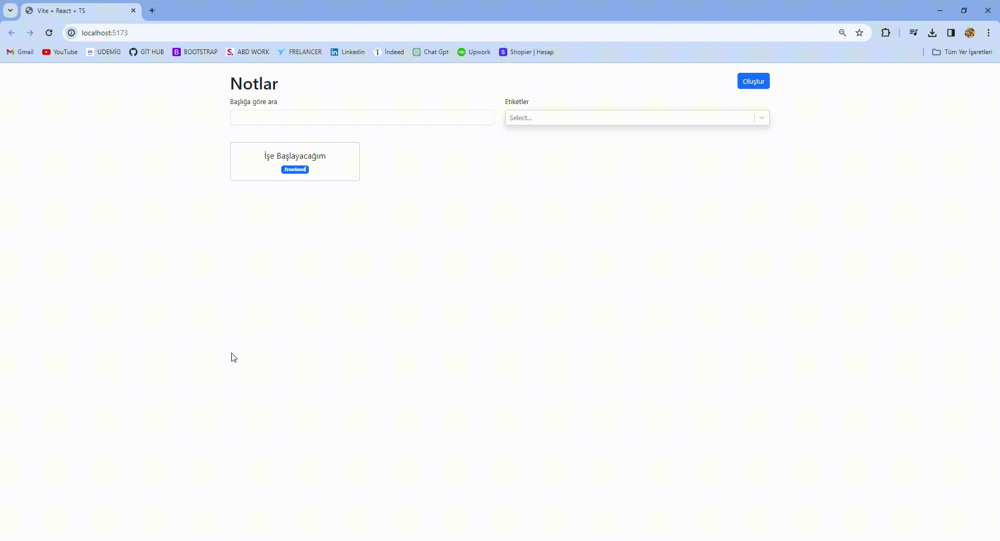

<h1>TypeScript Note Sitesi</h1>

TypeScript Kullanılarak Yapıldı

<h3>Kullanılan Kütüphaneler</h3>

<ul>
<li>bootstrap</li>
<li>react-bootstrap</li>
<li>react-markdown</li>
<li>react-router-dom</li>
<li>react-select</li>
<li>uuid</li>
</ul>

